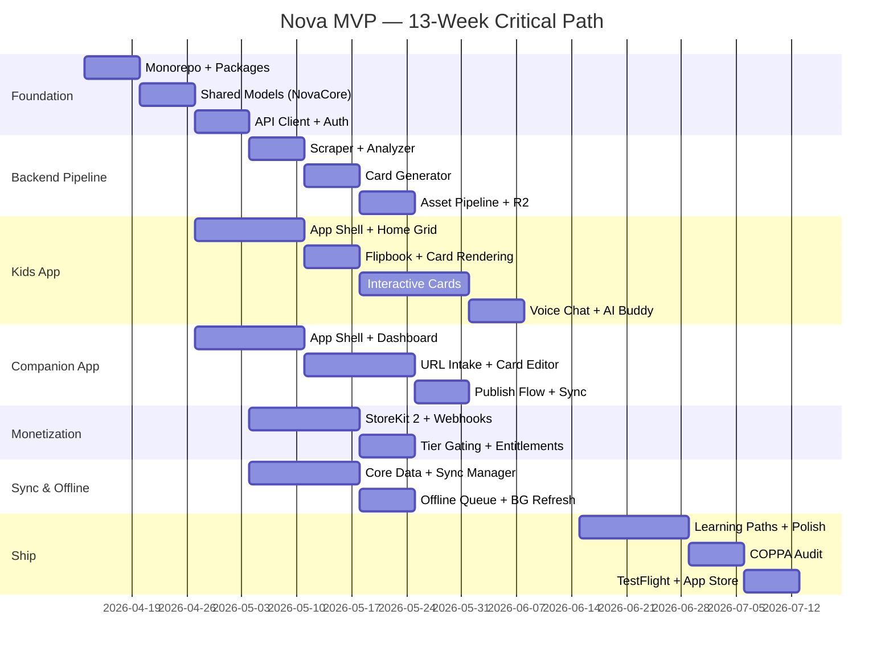

# Nova MVP — Comprehensive Build Plan

> Master build document for the Nova iOS learning platform. Covers architecture decisions, project breakdown, dependency mapping, sprint execution plan, and risk register.
>
> **Companion document:** [build-plan-jira-breakdown.md](build-plan-jira-breakdown.md) — Full 171-story Jira-style backlog across 20 epics.

---

## Table of Contents

1. [Executive Summary](#1-executive-summary)
2. [Architecture Decision Records](#2-architecture-decision-records)
3. [Project Structure — Epics Overview](#3-project-structure--epics-overview)
4. [Dependency Map & Critical Path](#4-dependency-map--critical-path)
5. [Sprint-by-Sprint Execution Plan](#5-sprint-by-sprint-execution-plan)
6. [Velocity & Capacity Model](#6-velocity--capacity-model)
7. [Risk Register](#7-risk-register)
8. [Quality Gates & Definition of Done](#8-quality-gates--definition-of-done)
9. [Launch Checklist](#9-launch-checklist)

---

## 1. Executive Summary

**Product:** Nova (working codename) — dual native iOS app platform teaching kids ages 4–8 about AI and technology through parent-curated, AI-generated visual flipbook lessons.

**Apps:** Nova Kids (iPad), Nova Companion (iPhone + iPad)

**Timeline:** 13 one-week sprints (Apr 13 – Jul 12, 2026)

**Team:** Solo developer (bang), comfortable with Swift, Python, Node.js

**Key Numbers:**

| Metric | Value |
|--------|-------|
| Total Epics | 20 |
| Total Stories | 171 |
| Total Story Points | ~680 |
| Avg Points/Sprint | ~52 |
| Critical Path Length | 13 weeks (no slack) |
| Architecture Decisions | 6 ADRs |
| Identified Risks | 12 |

**Phase Summary:**

| Phase | Sprints | Goal | Key Milestone |
|-------|---------|------|--------------|
| Foundation | 1–3 | Both apps scaffolded, auth working, first lesson on iPad | Kid swipes through 5-card lesson with voice narration |
| AI Pipeline + OAuth | 4–6 | URL → AI cards → edit → publish, OpenAI OAuth | Paste URL → AI generates cards → publish to iPad |
| Interaction + Subscriptions | 7–9 | Interactive cards, voice chat, StoreKit 2 | Kid does experiments, earns badges, talks to AI buddy |
| Polish & Ship | 10–13 | Learning paths, offline, COPPA audit, App Store | Both apps submitted to App Store |

---

## 2. Architecture Decision Records

### ADR-001: Swift Monorepo with Shared Local SPM Packages

**Status:** Accepted | **Date:** 2026-04-13

**Context:** Two iOS apps (Kids iPad-only, Companion iPhone+iPad) share significant domain logic. Solo developer needs fast iteration without version management overhead.

**Options Considered:**

| Option | Description | Verdict |
|--------|-------------|---------|
| A: Monorepo with local SPM | Single workspace, shared packages as local SPM | **Selected** |
| B: Separate repos + versioned SPM | Independent repos, packages published to registry | Rejected — too much overhead for solo dev |
| C: Single app, role-based UI | One app switches between kid/parent mode | Rejected — different platform targets (iPad-only vs universal), COPPA isolation harder |

**Decision:** Monorepo. Refactoring is instantaneous across all consumers, single CI pipeline, no version coordination.

**Consequences:** Harder to split later if team grows. Requires disciplined package boundaries to prevent tight coupling.

---

### ADR-002: Node.js/Fastify + TypeScript Backend

**Status:** Accepted | **Date:** 2026-04-13

**Context:** Backend serves REST API, manages OAuth tokens, runs AI content pipeline. Developer comfortable with both Node and Python.

**Options Considered:**

| Option | Description | Verdict |
|--------|-------------|---------|
| A: Node.js/Fastify + TypeScript + Prisma | TypeScript types mirror Swift Codable models | **Selected** |
| B: Python/FastAPI + SQLAlchemy | Strong for ML, weaker for web scraping tooling | Rejected |
| C: Swift/Vapor | All-Swift stack | Rejected — smaller ecosystem for scraping, less mature DevOps |

**Decision:** Node/Fastify. TypeScript type alignment with Swift models, Prisma ORM excellence, npm ecosystem has Puppeteer + Readability.js for the content pipeline.

**Consequences:** Context-switching between Swift and TypeScript. If complex ML is needed later, Python would be more natural.

---

### ADR-003: Hybrid LLM Provider Model (BYOK + Proxy)

**Status:** Accepted | **Date:** 2026-04-13

**Context:** App needs LLM for content pipeline. Two revenue models possible: parents bring their own OpenAI key (BYOK via OAuth) or use our proxy (subscription-funded).

**Options Considered:**

| Option | Description | Verdict |
|--------|-------------|---------|
| A: BYOK only | All users must have OpenAI account | Rejected — onboarding friction |
| B: Proxy only | We pay all compute | Rejected — high cost, no flexibility |
| C: Hybrid with provider router | BYOK reduces cost, proxy enables revenue | **Selected** |

**Decision:** Hybrid. Provider router in backend checks user's subscription tier and connected providers, routes accordingly. Future providers (Gemini, etc.) are just new protocol conformances.

**Consequences:** More complex auth/routing logic. But maximizes revenue optionality and is future-proof for multi-provider support.

---

### ADR-004: Core Data + REST Polling (Not CloudKit)

**Status:** Accepted | **Date:** 2026-04-13

**Context:** Kids app needs offline support. Data syncs between backend and both iOS apps.

**Options Considered:**

| Option | Description | Verdict |
|--------|-------------|---------|
| A: Core Data + REST polling | Standard iOS pattern, full control | **Selected** |
| B: CloudKit + NSPersistentCloudKit | Apple-managed sync | Rejected — backend still needed for AI pipeline, CloudKit is a black box |
| C: Realm with device sync | Third-party sync | Rejected — COPPA compliance concern, vendor dependency |

**Decision:** Core Data + REST. Backend is required regardless (AI pipeline, OAuth). Core Data is the iOS standard, COPPA-compliant (no third-party SDK), and conflict resolution is simple given the data model is mostly append-only.

**Consequences:** Manual conflict resolution needed. Background refresh reliability varies. But full debugging visibility via network tools.

---

### ADR-005: StoreKit 2 Native (Not RevenueCat)

**Status:** Accepted | **Date:** 2026-04-13

**Context:** Freemium subscription model (Free/Pro/BYOK tiers). Kids app must be COPPA-compliant.

**Options Considered:**

| Option | Description | Verdict |
|--------|-------------|---------|
| A: StoreKit 2 + server webhooks | Native framework, no third-party SDK | **Selected** |
| B: RevenueCat SDK | Abstracts StoreKit, great analytics | Rejected — third-party SDK in Kids app is COPPA risk |
| C: Custom receipt validation | Manual everything | Rejected — high complexity, security risk |

**Decision:** StoreKit 2. No third-party SDK in Kids app (COPPA), modern async API, server notifications for subscription lifecycle, native family sharing.

**Consequences:** More boilerplate than RevenueCat. No built-in analytics. If Android is added later, would need separate implementation.

---

### ADR-006: Cloudflare R2 for Asset Storage

**Status:** Accepted | **Date:** 2026-04-13

**Context:** Need CDN-backed storage for AI-generated images, TTS audio, lesson thumbnails.

**Options Considered:**

| Option | Description | Verdict |
|--------|-------------|---------|
| A: Cloudflare R2 | S3-compatible, zero egress fees, built-in CDN | **Selected** |
| B: AWS S3 + CloudFront | Largest ecosystem, battle-tested | Rejected — egress fees ($0.085/GB) kill margins on media-heavy app |
| C: Supabase Storage | Simpler setup | Rejected — less control, egress fees |

**Decision:** R2. Zero egress fees are critical for a media-serving app. S3-compatible API means migration to AWS is possible if needed. Workers integration enables edge image transforms.

**Consequences:** Smaller ecosystem than AWS. Less battle-tested. But S3 compatibility is an escape hatch.

---

## 3. Project Structure — Epics Overview

20 epics covering every component of the MVP. Full story-level breakdown (171 stories) is in [build-plan-jira-breakdown.md](build-plan-jira-breakdown.md).

| Epic | Name | Stories | Points | Primary Sprints | Domain |
|------|------|---------|--------|----------------|--------|
| EPIC-1 | Project Foundation & DevOps | 11 | 47 | 1 | Infrastructure |
| EPIC-2 | Shared Swift Packages | 12 | 40 | 1–2 | Shared |
| EPIC-3 | Authentication & User Management | 9 | 33 | 2–3 | Auth |
| EPIC-4 | Nova Kids — Home & Navigation | 8 | 29 | 2–3 | Kids App |
| EPIC-5 | Nova Kids — Flipbook & Card Rendering | 8 | 32 | 3–4 | Kids App |
| EPIC-6 | Nova Kids — Interactive Cards | 8 | 34 | 7 | Kids App |
| EPIC-7 | Nova Kids — AI Buddy (Sparky) | 8 | 38 | 9 | Kids App |
| EPIC-8 | Nova Kids — Progress & Gamification | 8 | 30 | 8 | Kids App |
| EPIC-9 | Nova Companion — Dashboard | 7 | 24 | 3–4 | Companion |
| EPIC-10 | Nova Companion — Content Studio | 11 | 50 | 5–6 | Companion |
| EPIC-11 | Nova Companion — Curriculum Manager | 6 | 22 | 10 | Companion |
| EPIC-12 | Nova Companion — Progress Dashboard | 7 | 26 | 8, 10 | Companion |
| EPIC-13 | Nova Companion — Settings & Account | 9 | 35 | 4, 9, 13 | Companion |
| EPIC-14 | Backend — API Server | 11 | 42 | 1–3 | Backend |
| EPIC-15 | Backend — LLM Provider Layer | 8 | 38 | 4 | Backend |
| EPIC-16 | Backend — AI Content Pipeline | 9 | 42 | 5 | Backend |
| EPIC-17 | Backend — Asset Pipeline | 7 | 30 | 6 | Backend |
| EPIC-18 | Backend — Subscription & Billing | 7 | 30 | 7, 9 | Backend |
| EPIC-19 | Sync & Offline | 8 | 34 | 8–9, 11 | Shared |
| EPIC-20 | Polish, Compliance & App Store | 13 | 52 | 10–13 | Ship |

### Story Point Distribution by Domain

```
Infrastructure:    47 pts  ( 7%)  ████
Shared Packages:   74 pts  (11%)  ██████
Auth:              33 pts  ( 5%)  ███
Kids App:         163 pts  (24%)  ████████████
Companion App:    157 pts  (23%)  ████████████
Backend:          182 pts  (27%)  █████████████
Ship/Polish:       52 pts  ( 8%)  ████
                  ─────────────
Total:            ~708 pts
```

---

## 4. Dependency Map & Critical Path

### Critical Path Visualization



### Critical Path (Longest Chain)

**Foundation → Backend Pipeline → Polish → Ship**

```
Monorepo Setup (S1)
  → NovaCore Models (S1-2)
    → API Client (S2)
      → URL Scraper (S4)
        → Content Analyzer (S5)
          → Card Generator (S5)
            → Asset Pipeline (S6)
              → [All features complete by S9]
                → Polish Sprint (S10-11)
                  → COPPA Audit (S12)
                    → TestFlight (S12)
                      → App Store Submission (S13)
```

**Total critical path: 13 weeks with zero slack.** Any delay on the pipeline chain directly impacts ship date.

### Parallel Work Streams

These chains run concurrently and do NOT block each other (after their shared foundation dependency in Sprint 1-2):

| Stream | Sprints | Can Slip Without Blocking Ship? |
|--------|---------|-------------------------------|
| Kids App UI (grid → flipbook → cards) | 3–9 | 1 week of slack vs pipeline |
| Companion App UI (dashboard → editor) | 3–6 | 2 weeks of slack |
| Auth + OAuth | 2–4 | No slack — blocks pipeline |
| StoreKit + Subscriptions | 7–9 | 1 week of slack (can ship without billing) |
| Offline + Sync | 8–11 | 2 weeks of slack |

### Key Dependency Chains

```
Chain A: Foundation
Monorepo → NovaCore → API Client → Both App Shells
                                  → Backend Routes

Chain B: Auth (blocks everything after Sprint 3)
Backend Auth → Apple Sign In → JWT → OAuth Flow → Provider Router

Chain C: Content Pipeline (critical path)  
API Server → Scraper → Analyzer → Card Generator → Asset Pipeline → Orchestrator

Chain D: Kids App Features
Shell → Home Grid → Flipbook → Story/Concept Cards → Interactive Cards → Voice Chat → Trophy Room

Chain E: Companion Features
Shell → Dashboard → URL Intake → Card Editor → Preview → Publish Flow → Curriculum Manager

Chain F: Monetization
StoreKit 2 → Server Webhooks → Entitlement Engine → Tier Gating

Chain G: Sync & Offline
Core Data Stack → Sync Manager → Offline Queue → BG Refresh → Asset Pre-download

Chain H: Ship (blocks launch)
All Features → Polish → COPPA Audit → TestFlight → App Store Submission
```

---

## 5. Sprint-by-Sprint Execution Plan

### Sprint 1 — "Scaffolding" (Apr 13–19)

**Goal:** Monorepo builds, both app shells launch, backend serves health check, database schema deployed.

| Allocation | iOS Kids | iOS Companion | Shared Pkgs | Backend | DevOps |
|-----------|---------|--------------|-------------|---------|--------|
| % | 15% | 15% | 30% | 30% | 10% |

**Key Stories:** NOVA-1 through NOVA-11 (monorepo, 4 SPM package scaffolds, Fastify + Prisma + Docker, Cloudflare R2 bucket, initial DB migration, dev environment docs)

**Exit Criteria:**
- `git clone && xcodebuild` succeeds for both app targets
- `docker-compose up` starts Postgres + Fastify
- `/api/v1/health` returns 200
- NovaCore imports into both apps without build errors

---

### Sprint 2 — "Models & Auth" (Apr 20–26)

**Goal:** Shared data models implemented, Apple Sign In working in both apps, JWT auth on backend, API client library functional.

| Allocation | iOS Kids | iOS Companion | Shared Pkgs | Backend | DevOps |
|-----------|---------|--------------|-------------|---------|--------|
| % | 20% | 20% | 30% | 25% | 5% |

**Key Stories:** NovaCore models (Lesson, Card, LearningPath, Progress, ChildProfile, Subscription), APIClient + APIRouter + Endpoints, NovaAuth (AuthManager, AppleSignIn, JWTHandler), backend auth routes + JWT middleware, user registration endpoint, child profile CRUD

**Exit Criteria:**
- Both apps sign in with Apple and receive JWT
- API client auto-injects tokens into requests
- Child profile creates/reads/updates via API
- All shared models compile and decode from API responses

---

### Sprint 3 — "First Lesson on iPad" (Apr 27–May 3)

**Goal:** Kids app shows Pinterest grid with sample lessons, flipbook renders Story + Concept cards with voice narration. Companion shows dashboard with lesson list.

| Allocation | iOS Kids | iOS Companion | Shared Pkgs | Backend | DevOps |
|-----------|---------|--------------|-------------|---------|--------|
| % | 40% | 25% | 15% | 15% | 5% |

**Key Stories:** HomeView (Pinterest masonry grid), LessonTileView, LearningPathRow, FlipbookView (swipe with page-flip animation), StoryCardView, ConceptCardView, progress dots, NovaVoice AVSpeechSynthesizer narration, basic Sparky face hint button, DashboardView, ActivityFeedView, basic sync (companion publishes → kids fetches)

**🎯 PHASE 1 MILESTONE:** Kid swipes through a 5-card "What is a Computer?" lesson on iPad with voice narration. Parent sees it on companion app.

**Exit Criteria:**
- Pinterest grid renders 3+ lessons correctly on iPad
- Flipbook swipe animation works smoothly
- AVSpeechSynthesizer reads card narration text aloud
- Tap-Sparky-to-hear interaction works
- Companion dashboard lists lessons with status

---

### Sprint 4 — "OpenAI OAuth + Provider Router" (May 4–10)

**Goal:** Parent can connect OpenAI account via OAuth in Companion app. Backend routes LLM calls through user's credentials or proxy. Provider settings screen functional.

| Allocation | iOS Kids | iOS Companion | Shared Pkgs | Backend | DevOps |
|-----------|---------|--------------|-------------|---------|--------|
| % | 10% | 30% | 20% | 35% | 5% |

**Key Stories:** OAuthFlowView (ASWebAuthenticationSession), backend OAuth callback handler, encrypted token storage (libsodium), token refresh cron, provider-router.ts, openai-provider.ts, proxy-provider.ts, LLMProviderView in settings, entitlement middleware, parental gate on settings

**Exit Criteria:**
- OAuth flow completes end-to-end (Companion → OpenAI → callback → token stored)
- Provider router correctly routes to BYOK or proxy based on user
- Token refresh works when access token expires
- LLM provider settings screen shows connection status

---

### Sprint 5 — "URL → AI Cards" (May 11–17)

**Goal:** Paste URL in Companion, AI analyzes content and generates age-appropriate lesson cards.

| Allocation | iOS Kids | iOS Companion | Shared Pkgs | Backend | DevOps |
|-----------|---------|--------------|-------------|---------|--------|
| % | 10% | 30% | 10% | 45% | 5% |

**Key Stories:** scraper.ts (Readability + Puppeteer fallback), content analyzer (LLM: key concepts, age-appropriateness, stage suggestion), card generator (LLM: structured JSON cards per type), prompt templates (system prompts for each stage, card schemas, safety filters), pipeline orchestrator (async job), URLIntakeView (paste → loading → AI analysis → "Generate Lesson"), QuickAddURLView

**Exit Criteria:**
- Scraper extracts content from 20+ test URLs successfully
- AI generates 5–8 age-appropriate cards from scraped content
- Cards match the Card model schema exactly
- URL intake in Companion shows analysis and generated cards
- Pipeline handles errors gracefully (bad URLs, scrape failures, LLM timeouts)

---

### Sprint 6 — "Edit, Preview & Publish" (May 18–24)

**Goal:** Card editor in Companion (adaptive layout), preview mode, publish flow syncs to Kids app. Asset pipeline generates TTS audio and illustrations.

| Allocation | iOS Kids | iOS Companion | Shared Pkgs | Backend | DevOps |
|-----------|---------|--------------|-------------|---------|--------|
| % | 15% | 35% | 10% | 35% | 5% |

**Key Stories:** CardEditorView (CardEditorPhone + CardEditorPad), card reordering (drag), text/image/voice script editing, LessonPreviewView, publish flow (status transition, triggers sync), tts-generator.ts (OpenAI TTS), image-generator.ts (DALL-E 3), asset-uploader.ts (R2), asset job queue (status tracking, retry), LessonLibraryView

**🎯 PHASE 2 MILESTONE:** Paste URL about "How robots learn" → AI generates 6 cards → edit in Companion → publish → kid sees on iPad with AI illustrations and voice narration.

**Exit Criteria:**
- Card editor works on iPhone (vertical stack) and iPad (side-by-side)
- Preview mode accurately simulates iPad flipbook experience
- Publish triggers sync; lesson appears in Kids app on next launch
- TTS audio generates for all cards
- DALL-E illustrations generate with consistent style
- Assets upload to R2 and are accessible via CDN URL

---

### Sprint 7 — "Experiments & Quizzes" (May 25–31)

**Goal:** Interactive card types in Kids app. StoreKit 2 subscription paywall.

| Allocation | iOS Kids | iOS Companion | Shared Pkgs | Backend | DevOps |
|-----------|---------|--------------|-------------|---------|--------|
| % | 40% | 15% | 15% | 20% | 10% |

**Key Stories:** ExperimentCardView (drag-and-drop engine, drop targets, haptic feedback, confetti), QuizCardView (multiple choice, tap, correct/incorrect, "try again"), card interaction types in generator prompt, StoreKit 2 integration (product configuration, paywall UI), SubscriptionView, backend webhook for server notifications

**Exit Criteria:**
- Experiment cards: kid can drag items to targets, success triggers confetti + haptic
- Quiz cards: tap answer, immediate feedback, progress recorded
- Subscription purchase works in sandbox
- Server receives StoreKit webhook and stores entitlement

---

### Sprint 8 — "Progress & Sync" (Jun 1–7)

**Goal:** Progress tracking end-to-end. Badge system. Core Data + sync manager. Companion progress dashboard.

| Allocation | iOS Kids | iOS Companion | Shared Pkgs | Backend | DevOps |
|-----------|---------|--------------|-------------|---------|--------|
| % | 25% | 25% | 25% | 20% | 5% |

**Key Stories:** Learning session tracking (start/end, card interactions, duration), badge criteria engine, TrophyRoomView + BadgeView, Core Data stack (full schema), SyncManager (pull lessons, push progress), ConflictResolver, ProgressView (completion timeline, time heatmap), VoiceLogView, badge gallery in Companion

**Exit Criteria:**
- Card interactions logged with timestamps and duration
- Badges awarded when criteria met (sparkle animation on earn)
- Trophy room displays earned/locked badges
- Core Data caches all lesson/card/progress data locally
- Progress syncs to backend; Companion shows accurate data

---

### Sprint 9 — "Voice Chat & Tier Gating" (Jun 8–14)

**Goal:** Sparky AI voice chat in Kids app. Subscription tier gating enforced end-to-end. Free vs Pro vs BYOK fully differentiated.

| Allocation | iOS Kids | iOS Companion | Shared Pkgs | Backend | DevOps |
|-----------|---------|--------------|-------------|---------|--------|
| % | 40% | 15% | 15% | 25% | 5% |

**Key Stories:** SparkyView (voice chat UI), SparkyAnimator (idle/listening/talking/celebrating), voice chat loop (SFSpeechRecognizer → LLM → OpenAI TTS → animated response), kid-safe guardrails (system prompt, topic bounding, off-topic redirect), VoiceCardView, entitlement engine (tier resolution), usage metering (proxy call counting), tier gating in both apps, family sharing support

**🎯 PHASE 3 MILESTONE:** Kid teaches Sparky what blue things are, earns a badge, and has a voice conversation about what he learned. Subscription flow works end-to-end.

**Exit Criteria:**
- Voice chat: kid speaks, Sparky responds with animated expressions
- Guardrails prevent off-topic conversation
- Free users see 3 starter paths only
- Pro users access full AI pipeline
- BYOK users route through their own OpenAI credentials
- Family sharing recognized by StoreKit

---

### Sprint 10 — "Learning Paths & Curriculum" (Jun 15–21)

**Goal:** Structured learning paths in both apps. Curriculum manager. Polish pass on home grid.

| Allocation | iOS Kids | iOS Companion | Shared Pkgs | Backend | DevOps |
|-----------|---------|--------------|-------------|---------|--------|
| % | 30% | 35% | 15% | 15% | 5% |

**Key Stories:** Learning path data model + backend routes, Pinterest home grid with path progress, LearningPathRow polish, CurriculumView (paths list, drag to reorder), PathEditorView (assign lessons, set prerequisites), stage progression timeline, create/edit/delete paths, Companion progress dashboard polish

**Exit Criteria:**
- Kids app home shows learning paths with horizontal scroll and progress bars
- Companion can create/edit/reorder learning paths
- Prerequisites enforced (locked lessons show lock icon)
- 3 learning paths populated with content for Explorer stage

---

### Sprint 11 — "Offline & Performance" (Jun 22–28)

**Goal:** Full offline support. Asset pre-download. Performance optimization.

| Allocation | iOS Kids | iOS Companion | Shared Pkgs | Backend | DevOps |
|-----------|---------|--------------|-------------|---------|--------|
| % | 25% | 15% | 35% | 15% | 10% |

**Key Stories:** OfflineSyncQueue (queue events when offline, flush on reconnect), asset pre-download (images + audio on lesson sync), BGTaskScheduler (background refresh), graceful offline degradation (cached lessons playable, voice chat disabled), performance audit (Instruments profiling, memory leaks, animation frame rate), image compression, lazy loading

**Exit Criteria:**
- Kids app plays cached lessons with zero network (airplane mode test)
- Progress events queue offline and sync when network returns
- Background refresh downloads new lessons automatically
- No memory leaks in Instruments profiling session
- Flipbook animation holds 60fps on iPad Air

---

### Sprint 12 — "COPPA & TestFlight" (Jun 29–Jul 5)

**Goal:** COPPA compliance verified. Privacy policies published. TestFlight beta distributed.

| Allocation | iOS Kids | iOS Companion | Shared Pkgs | Backend | DevOps |
|-----------|---------|--------------|-------------|---------|--------|
| % | 20% | 20% | 10% | 15% | 35% |

**Key Stories:** COPPA compliance audit (PII collection review, parental gate audit, third-party SDK audit), privacy policy (published URL, linked in both apps), age gate verification, data export endpoint (COPPA right to access), data deletion endpoint (COPPA right to delete), privacy nutrition labels for both apps, onboarding flows (Kids: character intro, Companion: setup wizard), App Store metadata draft, TestFlight beta build + distribution

**Exit Criteria:**
- COPPA checklist 100% pass (no PII from kids without consent, no third-party analytics in Kids app, parental gate on all settings)
- Privacy policy published at accessible URL
- Data export and deletion endpoints working
- TestFlight build distributed to 5+ beta testers
- Both apps install and run from TestFlight without crashes

---

### Sprint 13 — "Ship It" (Jul 6–12)

**Goal:** App Store submission. Launch monitoring. Post-launch plan.

| Allocation | iOS Kids | iOS Companion | Shared Pkgs | Backend | DevOps |
|-----------|---------|--------------|-------------|---------|--------|
| % | 15% | 15% | 5% | 15% | 50% |

**Key Stories:** App Store screenshots (all iPad sizes + iPhone sizes), app preview video, description copy + keywords, age rating submission, demo account for App Review (with pre-populated lessons), review notes explaining Kids category compliance, submit both apps, monitoring dashboard (server health, error rates), feature flags for post-launch rollout, hotfix workflow, crash reporting (privacy-compliant), post-launch support plan

**🎯 PHASE 4 MILESTONE:** Both apps submitted to App Store with complete Explorer stage curriculum (8–10 lessons across 3 learning paths).

**Exit Criteria:**
- Both apps submitted and accepted by App Store (or in review)
- Server monitoring active with alerts
- Feature flags tested in production
- Crash reporting functional
- Post-launch bug triage plan documented

---

## 6. Velocity & Capacity Model

### Solo Developer Capacity

| Parameter | Value | Notes |
|-----------|-------|-------|
| Available hours/week | 40–50 | Assuming full-time commitment |
| Story points/week (target) | 50–55 | Based on estimated velocity |
| Buffer | 10% | Applied to each sprint for unknowns |
| Total capacity (13 sprints) | ~650–715 pts | 708 total points is tight but feasible |

### Points Distribution by Sprint

| Sprint | Target Points | Primary Focus |
|--------|-------------|---------------|
| 1 | 47 | Foundation (infrastructure-heavy, parallel scaffolding) |
| 2 | 50 | Models + Auth (shared packages are high-value) |
| 3 | 55 | First lesson on iPad (highest-value milestone) |
| 4 | 55 | OAuth + Provider Router (backend-heavy) |
| 5 | 60 | AI Pipeline (most complex backend sprint) |
| 6 | 58 | Card Editor + Assets (dual frontend + backend) |
| 7 | 55 | Interactive Cards + StoreKit (new domains) |
| 8 | 55 | Progress + Sync (deep infrastructure) |
| 9 | 58 | Voice Chat + Tier Gating (highest integration risk) |
| 10 | 50 | Learning Paths + Polish (UI-focused) |
| 11 | 48 | Offline + Performance (optimization) |
| 12 | 45 | COPPA + TestFlight (compliance + distribution) |
| 13 | 40 | App Store (submission + monitoring) |

### Contingency: What Gets Cut If Behind Schedule

Prioritized cut list (first to go → last to go):

1. **Trophy room animations** — badges still work, just without sparkle effects
2. **Video Card type** — defer to post-launch; Story/Concept/Experiment/Quiz/Voice cover MVP
3. **Time heatmap in Companion** — basic completion stats remain
4. **Voice interaction log viewer** — progress data still collected, just no viewer
5. **Suggested next lessons (AI-powered)** — manual curriculum ordering replaces this
6. **iPad card editor layout** — iPhone editor works universally; iPad side-by-side is a nice-to-have
7. **YouTube transcript extraction** — URL scraping works for articles; YouTube is an enhancement

**Never cut:** Auth, core flipbook, AI pipeline, StoreKit, COPPA compliance, offline basic

---

## 7. Risk Register

| ID | Risk | Prob | Impact | Sprint | Mitigation | Contingency |
|----|------|------|--------|--------|-----------|-------------|
| R01 | AI generates inappropriate content for a 4-year-old | Med | Critical | 5–13 | Parent review gate is mandatory (no auto-publish), content safety pre-screen in system prompt, age-appropriate language filters | Add secondary LLM safety classifier; manual content flagging in Companion |
| R02 | OpenAI changes/deprecates OAuth endpoints or scopes | Med | High | 4–13 | Provider abstraction layer isolates the change; monitor OpenAI changelog; store versioned OAuth config | Switch to API key-based BYOK (less elegant but functional); pivot to proxy-only temporarily |
| R03 | Voice recognition unreliable for young children | High | Med | 8–13 | Tap-to-talk (not always-on); Apple SFSpeechRecognizer improves with use; fallback to tap interactions | Disable voice chat feature; pivot to visual-only interactions; add voice training mode |
| R04 | URL scraping fails on JS-heavy / paywalled sites | Med | Med | 5–13 | Puppeteer fallback for JS rendering; manual paste option; YouTube transcript extraction; PDF upload | Provide "paste text" alternative; curate a list of known-good source domains |
| R05 | App Store rejects for Kids category / COPPA violation | Med | Critical | 12–13 | Design for Kids category from day 1; no third-party analytics in Kids app; no ads; parental gate everywhere; legal review in Sprint 12 | Resubmit with addressed issues; engage Apple DTS for guidance; delay launch if needed |
| R06 | StoreKit 2 subscription edge cases (grace period, billing retry, family sharing) | Med | High | 7–13 | Server-side validation catches all state changes; handle grace periods explicitly; test all subscription states in sandbox | Manual entitlement override endpoint for customer support; fallback to receipt validation |
| R07 | Scope creep delays critical path | High | High | All | Phase milestones as forcing functions; sprint exit criteria enforce scope; cut list pre-defined | Execute contingency cut list (Section 6); extend timeline by max 2 weeks |
| R08 | Core Data migration breaks on user devices after update | Low | Critical | 8–13 | Lightweight migrations only; schema versioning; TestFlight validates migrations | Backend resync endpoint to rebuild local cache; user-facing "reset data" option |
| R09 | Asset pre-download consumes excessive storage/bandwidth | Med | Med | 11 | WiFi-only pre-download; free space check before download; aggressive image compression (WebP) | On-demand streaming; user controls for cache size; "download lesson" manual trigger |
| R10 | OpenAI API rate limits / outages block card generation | Med | High | 5–13 | Exponential backoff + retry; cache generated cards; queue failed jobs for retry | Template-based fallback cards; manual card creation in Companion; graceful degradation UI |
| R11 | Solo developer burnout over 13-week sprint | Med | Critical | All | Sustainable pace (40h/week target, not 60h); built-in buffer; cut list prevents death march | Extend timeline to 16 weeks; hire contract help for polish phase; reduce scope |
| R12 | DALL-E illustration style inconsistency across lessons | Med | Low | 6–13 | Consistent style prompt (e.g., "flat vector illustration, pastel colors, friendly character style"); style guide document for prompts | Use a fixed set of pre-made illustrations for MVP; defer AI illustration to post-launch |

---

## 8. Quality Gates & Definition of Done

### Story-Level Definition of Done

A story is "Done" when ALL of the following are true:

- [ ] Code compiles without warnings
- [ ] All acceptance criteria checkboxes are checked
- [ ] UI matches design spec (or is explicitly deferred to polish sprint)
- [ ] No memory leaks visible in Instruments
- [ ] Works on iPad Air (minimum target) and iPhone SE (Companion)
- [ ] Accessibility: VoiceOver reads all interactive elements
- [ ] Error states handled (network down, empty data, invalid input)
- [ ] Loading states present (no blank screens during async operations)
- [ ] Code committed with descriptive message referencing NOVA-xxx

### Sprint-Level Quality Gates

| Gate | Criteria | Enforced At |
|------|----------|------------|
| **Build Gate** | Both apps compile, all tests pass, no warnings | Every commit |
| **Integration Gate** | API client successfully communicates with backend | Sprint 2+ |
| **Sync Gate** | Data round-trips: Companion → Backend → Kids App | Sprint 3+ |
| **Pipeline Gate** | URL → cards → assets → published lesson (end-to-end) | Sprint 6+ |
| **Offline Gate** | Kids app functions in airplane mode | Sprint 11+ |
| **COPPA Gate** | Full compliance checklist passes | Sprint 12 |
| **Ship Gate** | TestFlight builds install cleanly, no crash in first 5 min | Sprint 12–13 |

### Phase Milestones (Must-Hit Gates)

| Phase | Sprint | Gate | Pass Criteria |
|-------|--------|------|--------------|
| 1 | 3 | First Lesson | Kid swipes 5-card lesson with voice on iPad |
| 2 | 6 | Pipeline E2E | URL → AI cards → edit → publish → appears on iPad |
| 3 | 9 | Full Feature | Interactive cards + voice chat + subscriptions working |
| 4 | 13 | Ship | Both apps accepted in App Store review |

---

## 9. Launch Checklist

### Pre-Submission (Sprint 12)

- [ ] COPPA compliance audit completed (legal sign-off)
- [ ] Privacy policy published and linked in both apps
- [ ] Parental gate tested on all settings/account screens
- [ ] No third-party analytics SDKs in Kids app
- [ ] Data export endpoint working (COPPA right to access)
- [ ] Data deletion endpoint working (COPPA right to delete)
- [ ] Privacy nutrition labels accurate for both apps
- [ ] Age rating set correctly (4+)
- [ ] TestFlight beta distributed and no critical bugs

### App Store Submission (Sprint 13)

- [ ] App Store Connect configured for both apps
- [ ] Screenshots for all required device sizes
- [ ] App preview video (optional but recommended)
- [ ] Description, keywords, and promotional text written
- [ ] Demo account created with pre-populated lessons
- [ ] Review notes explain Kids category compliance
- [ ] Support URL and marketing URL set
- [ ] Both apps submitted for review

### Launch Day Readiness

- [ ] Server monitoring dashboard live (uptime, error rates, latency)
- [ ] Alerts configured (>1% error rate, >500ms p95 latency, server down)
- [ ] Feature flags tested (ability to disable voice chat, AI pipeline remotely)
- [ ] Hotfix workflow documented (emergency build → TestFlight → expedited review)
- [ ] Crash reporting active (privacy-compliant, no PII)
- [ ] Customer support email configured
- [ ] Database backup schedule verified
- [ ] R2 CDN health check passing

### Post-Launch (Week 1)

- [ ] Monitor crash-free rate (target: >99.5%)
- [ ] Monitor subscription conversion rate
- [ ] Triage and fix any App Review issues
- [ ] Collect beta tester feedback
- [ ] Plan Sprint 14 based on real usage data
